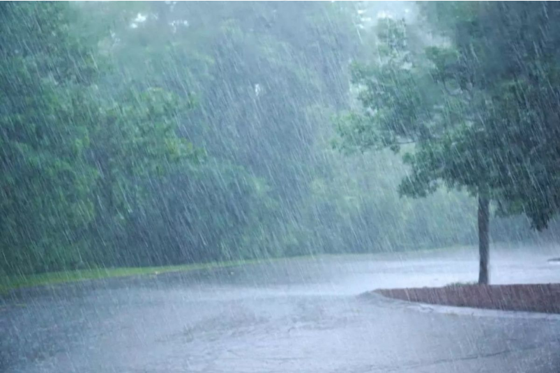

# RainFall

this team 42 project following SnowCrash aims to discover and exploit some bugs or vulnerabilities in various situations.

## Useful tools

- ghidra (to decompile binaries)
- gdb to precisely analyze the runtime

## Used exploits
 
 - buffer overflows 
 - ret2libc
 - fstring attacks
 - ...

## Resources

 - [ret2libc](https://www.ired.team/offensive-security/code-injection-process-injection/binary-exploitation/return-to-libc-ret2libc)

 - [fstring attacks](https://owasp.org/www-community/attacks/Format_string_attack)