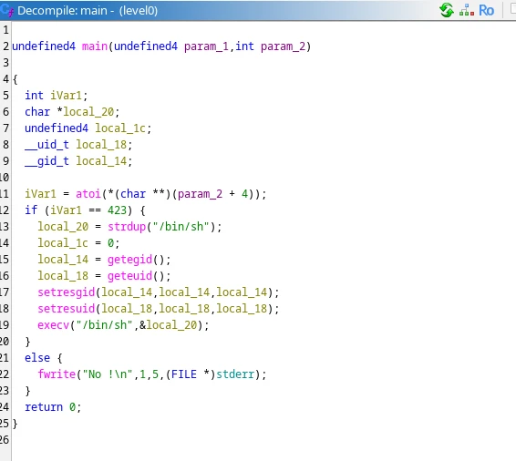

**LEVEL 0**

we connect to level0, download file level0 and decompile it using ghidra.



reading the code we can see this executable check if the first argument is "423" and then spawn a shell using with user level1

```bash
./level0 423
cd /home/level1
ls # shows .pass
cat .pass
su level1
```