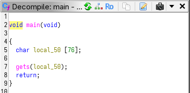
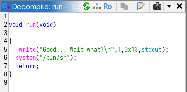
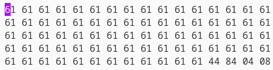
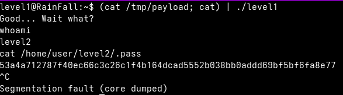

**LEVEL 1**

we connect to level1, download file level1 and decompile it using ghidra.

the main function just calls gets() on a buffer of size 76.




above the main we find a function called run(). Its address is 08044484.



we need to create a payload file to overflow the buffer we can do it like that using ghex:



or using python:

```bash
python -c 'print "-"*76 + "\x84\x44\x04\x08"' > payload
```

next we need to write the payload on stdin AND keep access to it before a segfault happens.

This command allows us to do so:

